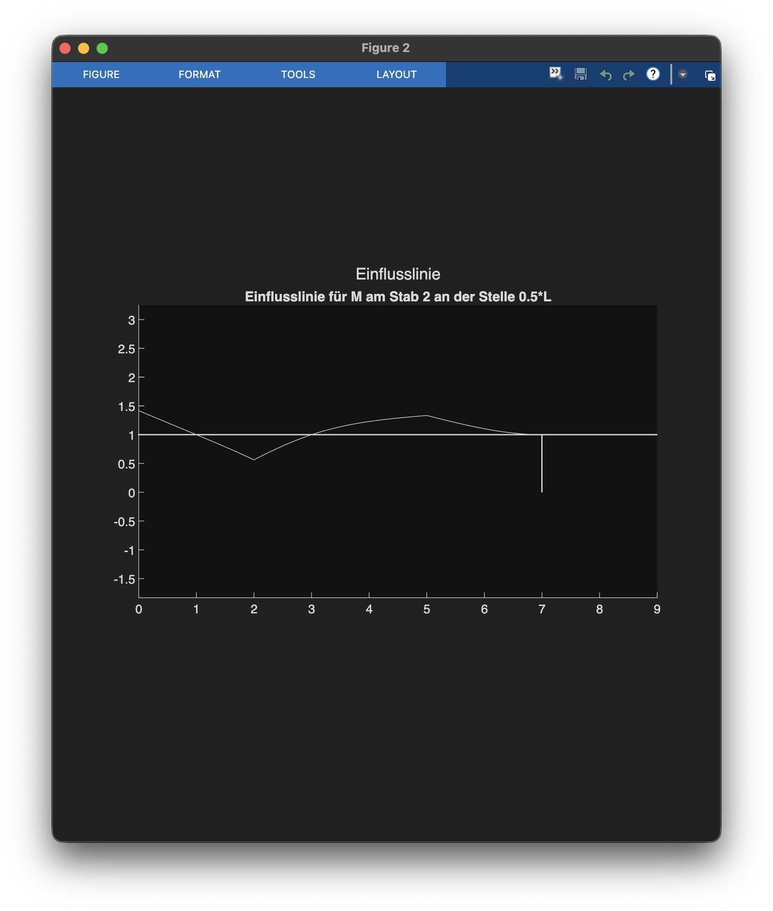
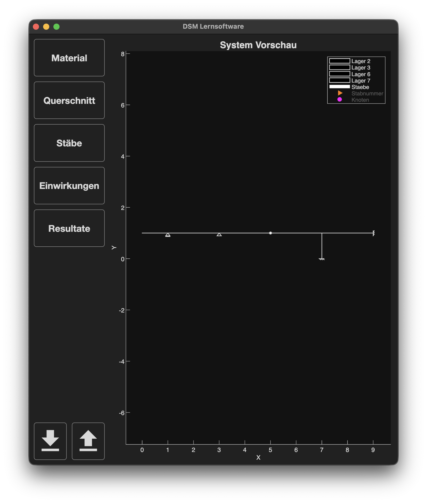
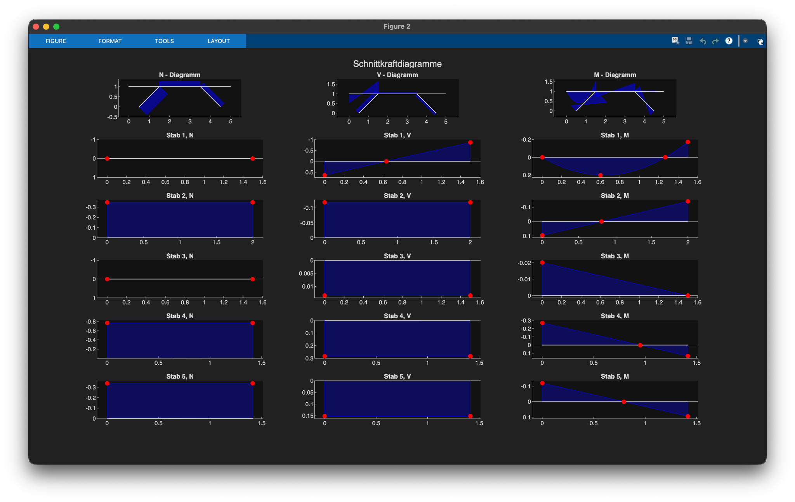
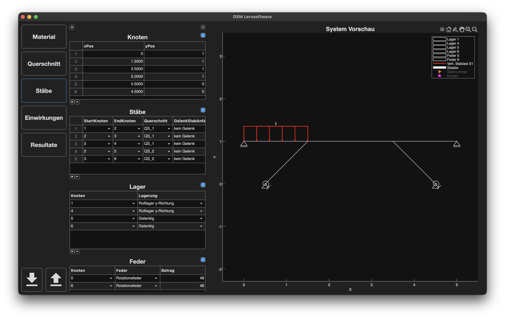

# Lernsoftware zur Direkten Steifigkeitsmethode (DSM)

MATLAB-basierte **Lehrsoftware zur Berechnung von Schnittkräften, Auflagerreaktionen und Einflusslinien** mithilfe der **Direkten Steifigkeitsmethode (DSM)** – inklusive **grafischer Benutzeroberfläche (GUI)**.

Die Software richtet sich primär an Studierende der Vorlesung „Baustatik II" im 4. Semester des Bachelorstudiums Bauingenieurwissenschaften an der ETH Zürich. Die Software soll Studierenden ermöglichen, eigene Tragsysteme zu modellieren, deren Schnittkräfte, Auflagerreaktionen oder Einflusslinien zu berechnen, und die Resultate direkt mit eigenen Handrechnungen zu vergleichen.

---

## Installation & Nutzung

### Voraussetzungen

- MATLAB **R2025b** (getestet; frühere Versionen nicht verifiziert)  

### Installation

**Variante 1: Repository klonen**

Führe den folgenden Befehl in einem Terminal aus:

    git clone https://github.com/ETH-IBK-SMECH/DSM-und-Einflusslinien.git

**Variante 2: ZIP-Download**

1. Klicke auf **Code → Download ZIP**
2. Entpacke das Repository

### Start der Software

1. Öffne MATLAB, indem du die Datei `startup.m` per Doppelklick öffnest. Dadurch wird der Projektpfad korrekt gesetzt.

2. Starte die grafische Benutzeroberfläche, indem du im MATLAB Command Window eingibst:

       GUI

---

## Projektstruktur

Die Software ist modular aufgebaut und weist eine klare Trennung zwischen Rechenkern (DSM), grafischer Benutzeroberfläche (GUI) und dem übergeordneten Ausführungsablauf auf.


```text
src/
├── Main/
│   ├── MatrizenStatik.m                 # Hauptablauf
│   └── DirectStiffnessMethod.m          # DSM-Steuerung
├── DSM/                                 # Solverkern (Direkte Steifigkeitsmethode)
│   ├── Vorbereitung/                    # Eingabeaufbereitung
│   ├── Assemblierung/                   # Systemaufbau
│   ├── Loesen/                          # Lösen des Gleichungssystems
│   ├── Nachrechnung/                    # Schnittgrössen und Reaktionen
│   ├── Output/                          # Ausgabe und Visualisierung
│   └── Hilfsfunktionen/                 # Allgemeine Hilfs- und Utility-Funktionen
└── GUI/
    ├── @GUI/
    │   ├── GUI.mlapp                    # Benutzeroberfläche
    │   ├── guiToInput.m                 # GUI → Solver
    │   ├── buildPreviewModel.m          # Vorschau-Modell
    │   └── updateLiveViewer.m           # Live-Darstellung
    └── Validation/                      # Eingabeprüfung
```

---

## GUI & Ergebnisbeispiele

Beispielhafte Resultate aus der Software:

<table>
  <tr>
    <td align="center">
      
      <br>
      <em>Einflusslinie (Beispiel)</em>
    </td>
    <td align="center">
      
      <br>
      <em>Systemvorschau in der GUI</em>
    </td>
  </tr>
</table>


<em>Schnittkraftdiagramme (N, V, M)</em>

<br><br>


<em>Eingabe und Visualisierung in der GUI</em>

---

## Video-Tutorial

Ein kurzes Video-Tutorial befindet sich im Ordner `docs/`.  
Es dient als kompakter Einstieg und Überblick über die Nutzung der App und erklärt

- wie die Software installiert und gestartet wird,
- welche Hauptfunktionen und Features die App bietet,
- und wie ein vollständiges Beispielsystem in der GUI aufgebaut und ausgewertet wird.

--- 

## GUI & Erweiterbarkeit

Die GUI stellt die **primäre Schnittstelle** zur Software dar und erlaubt es, Tragwerke
schrittweise aufzubauen und Resultate direkt visuell zu überprüfen.

Der zugrunde liegende Code ist **modular** aufgebaut:

- Neue Elemente, Lastfälle oder Auswertungen können einfach ergänzt werden.
- GUI und Rechenkern können unabhängig weiterentwickelt werden.

Für Studierende, die sich vertieft mit der Implementierung der DSM auseinandersetzen möchten, stellt die Datei `src/Main/DirectStiffnessMethod.m` den **zentralen Einstiegspunkt** dar. Dort sind die wesentlichen mechanischen Rechenschritte der Direkten Steifigkeitsmethode klar aufgeführt und **strukturell analog zur Behandlung im Kurs „Baustatik II"** organisiert.

---

## Hinweise und Support

Bei Problemen, Fehlern oder Verbesserungsvorschlägen:

- Bitte zuerst prüfen, ob bereits ein entsprechendes **Issue** existiert
- Andernfalls ein neues **GitHub Issue** eröffnen
- Alternativ direkt Kontakt mit den **Betreuenden des Projekts** aufnehmen

---

## Beteiligte Personen

Die Software wurde ursprünglich im Rahmen einer Bachelorarbeit von T. Kirupakaran unter der Betreuung von Dr. A. Egger und P. Sieber entwickelt.  
Die Weiterentwicklung der Software erfolgte im Rahmen einer Master-Projektarbeit von M. Eichenberger unter der Betreuung von Dr. A. Egger und F. Betti.  
Die betreuende Professorin war in beiden Projekten Prof. Dr. Eleni Chatzi.
